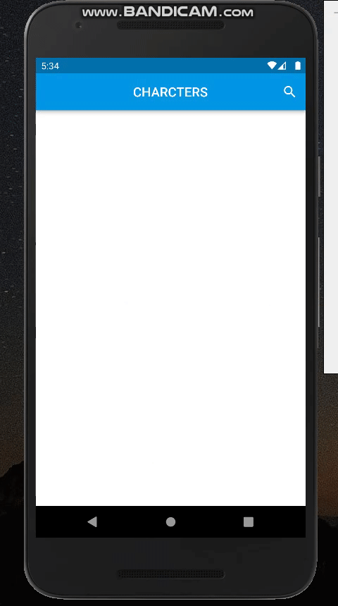
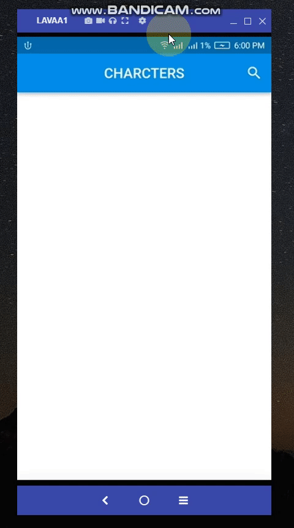

<h1 align="center">
Movie BLoC Flutter App
</h1>

    

# ℹ️ Overview
- Used Flutter with BLoC pattern to make Movie BLoC App to show some information about my favorite series Breaking Bad. 
- Played with some fancy UI widgets.

# 📌 Used API

- Free API : https://breakingbadapi.com/documentation

# 📱 Screens
1-Overview:

2- Search functionality:

3- The app can handle internet connection errors:

